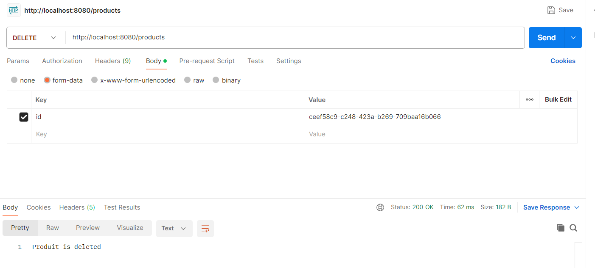

## Cassandra
# Docker
  
# Application.properties
  
# Docker-compose
  
# Entities
  
# Repositories
  
# Service
  
# Postman
  
  
  
  
  
## Informations utiles
1- il faut d'abord installer docker desktop  
2- il faut créer le fichier docker-compose.yaml et inscrire la configuration relatif à cassandra  
3- Il faut ouvrir le fichier de ligne de commande dans le repertoire ou se trouve le fichier docker-compose.yaml  
4- Il faut lancer la commande docker-compose up -d cela aura pour effet d'installer l'image de cassandra si elle n'est pas encore téléchargé et lancer le container  
5- il faut saisir docker ps en ligne de commande pour afficher les différentes instances 
6- copier l'identifiant relatif à cassandra 
7- Toujours en ligne de commande il faut saisir docker exec -it 89ca74fa914a cqlsh 